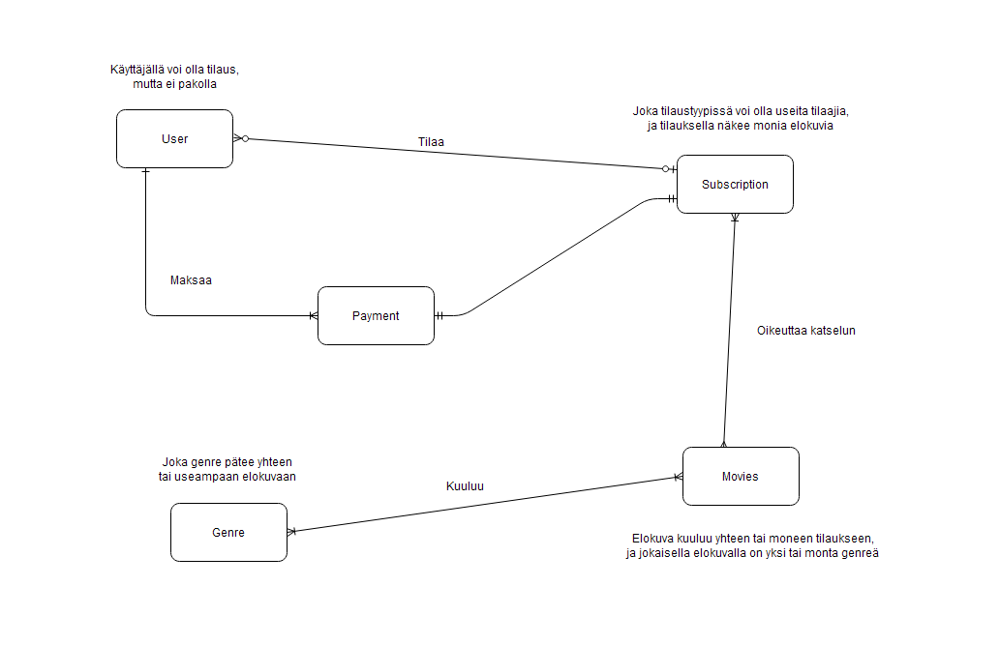

# Streaming -palvelun tietokanta

## Yleistietoa

Tietokantaharjoituksen toteuttaa Leevi Seppäläinen (AA3567) toimeksiantona opintojakson TTC2020-3003 harjoitustyöksi. Tietokantaratkaisun on tarkoitus tarjota suoratoistopalvelun pyörittämiseen vaadittavalle datalle tietokantaratkaisu. Lähtökohtaisesti siinä varastoidaan tietoa palvelun tilaajista, tilauksista, elokuvista ja niiden tyylilajeista.

## Tietokannan rakenne

### Käsitemalli

Lähdin liikkelle käsitemallin laatimisesta, jossa keskityin pääosin siihen, mitä tauluja tietokantaan tarvitaan ja millaiset suhteet niiden välillä on.

### ER-malli

Seuraavaksi loin workbenchissa ER-kaavion tietokannasta, johon lisäsin sarakkeet eri tauluissa.

