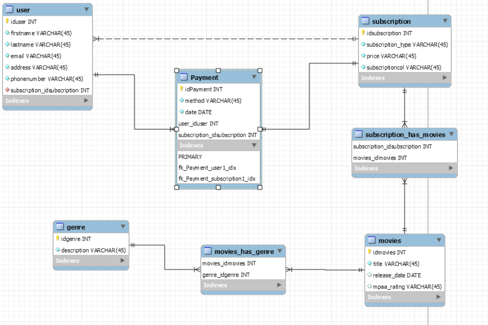

# Streaming -palvelun tietokanta

## Yleistietoa

Tietokantaharjoituksen toteuttaa Leevi Seppäläinen (AA3567) toimeksiantona opintojakson TTC2020-3003 harjoitustyöksi. Tietokantaratkaisun on tarkoitus tarjota suoratoistopalvelun pyörittämiseen vaadittavalle datalle tietokantaratkaisu. Lähtökohtaisesti siinä varastoidaan tietoa palvelun tilaajista, tilauksista, elokuvista ja niiden tyylilajeista.

## Tietokannan rakenne

### Käsitemalli

Lähdin liikkelle käsitemallin laatimisesta, jossa keskityin pääosin siihen, mitä tauluja tietokantaan tarvitaan ja millaiset suhteet niiden välillä on.

### ER-malli

Seuraavaksi loin workbenchissa ER-kaavion tietokannasta, johon lisäsin sarakkeet eri tauluissa. Tein vielä päätöksen, että jokaisella käyttäjällä on oltava voimassa oleva tilaus.

Kaavioon piti tehdä vielä pieniä hienosäätöjä. Poistin subscription ja movien väliltä moni-moneen yhteyden, sillä se oli ehkä väärä ratkaisusta riippuen. Tässä hain sitä, että tietyllä tilauksella näkee eri elokuvia, esimerkiksi korkeimman tason tilauksella uusimmat elokuvat. Lisäsin myös primary key sarakkeisiin auto incrementin, jotta tietokantaan tiedon lisääminen on helpompaa.

## Toiminnallisuus

### ALTER TABLE

Tässä vaiheessa huomasin, että user ja date, joita er-kaaviossa olen käyttänyt, ovat varattuja sanoja joten niiden vaihto toisiin:
ALTER TABLE user RENAME TO account;
ALTER TABLE payment CHANGE date payment_date date;

Tämän lisäksi muutin release_daten -> release_year:
ALTER TABLE movie CHANGE release_date release_year INT;

### INSERT INTO Lauseet

INSERT INTO genre(name) VALUES
("Romance"), ("Comedy"), ("Sci-Fi"), ("Action"), ("Fantasy"), ("Drama"), ("Thriller"), ("Horror");

INSERT INTO subscription(subcription_type,price,quality) VALUES
("Casual","5,99","720p"),
("Basic","9.99","1080p"),
("Pro","15,99","4k");

INSERT INTO account(firstname,lastname,email,address,phonenumber,subscription_idsubscription) VALUES
("Jari","Purhonen","jari.purhonen@sahkoposti.fi","Konttisentie 3","04401294950",3),
("Jukka","Tikka","tikisjukka@gmail.com","Noukanniementie 27","0449290294",1),
("Kari","Lyijynen","lyijy@luukku.com","Tikstaalintie 11","0552935100",2),
("Suvi","Kananoja","suvi.kananoja@gmail.com","Heikinahde 8","0204924001",1),
("Katri-Helena","Hulkkonen","katrihulkkonen@hotmail.com","Urheilutie 33","0500123121",3),
("Paula","Oittinen","oittisenpaula@gmail.com","Vaajatie 5","0404912312",3);

INSERT INTO payment(method,payment_date,user_iduser,subscription_idsubscription) VALUES
("Visa","2021-3-14",1,3),
("Paypal","2021-4-01",2,1),
("Paypal","2021-3-29",3,2),
("Visa","2021-3-21",4,1),
("Mobilepay","2021-4-10",5,3),
("Visa","2021-3-13",6,3);

INSERT INTO movie(title,release_year,mpaa_rating,subscription_idsubscription) VALUES
("The Wizard of Oz",1939,"PG",1),
("Parasite",2020,"R",2),
("Citizen Kane",1941,"PG",1),
("Zack Snyder's Justice League",2021,"R",3),
("Avengers Endgame",2019,"PG-13",3),
("The Godfather",1972,"R",2);

INSERT INTO movie_has_genre(movie_idmovie,genre_idgenre) VALUES
(1,5),
(2,7),
(2,2),
(3,6),
(4,4),
(5,4),
(5,3),
(6,6);

### Tietokannan käyttö

Seuraavalla haulla voidaan tehdä taulu, josta nähdään kaikki elokuvat genreineen listattuna.

SELECT m.title, m.release_year, m.mpaa_rating, group_concat(DISTINCT g.name ORDER BY g.name DESC SEPARATOR ", ") as Genre
FROM movie m
INNER JOIN movie_has_genre mg ON m.idmovie = mg.movie_idmovie
INNER JOIN genre g ON mg.genre_idgenre = g.idgenre
GROUP BY m.idmovie, m.title, g.name;

Hakua voidaan myös muokata näyttämään esim. vain Action genren elokuvat:
SELECT m.title, m.release_year, m.mpaa_rating, group_concat(DISTINCT g.name ORDER BY g.name DESC SEPARATOR ", ") as Genre
FROM movie m
INNER JOIN movie_has_genre mg ON m.idmovie = mg.movie_idmovie
INNER JOIN genre g ON mg.genre_idgenre = g.idgenre
WHERE genre_idgenre = 4
GROUP BY m.idmovie, m.title, g.name;

## Parannusideat ja ehdotukset 

Elokuvien ja tilauksen välillä yhteyttä voisi kyllä muokata toimimaan niin, että myös alemman tason tilaukseen kuuluvat elokuvat kuuluisivat myös ylemmän tason tilauksiin. Tämän ehkä saisi sittenkin tehtyä moni-moneen yhteydellä, jonkinlaisella skriptillä toteuttaen muokaten jo olemassa olevaa. Jonkinlainen ratkaisu olisi myös mahdollista tehdä account-payment-subscription -sumppuun, joka selkeyttäisi tuota osiota ja tekisi siitä järkevämmän. 

## Ajan käyttö

Ideointiin käytin aikaa n. 2h. Pohdin minkälainen tietokanta olisi järkevää toteuttaa ja mitä siihen vaadittaisiin. Sen jälkeen lähdin tekemään vaatimusmäärittelyä ja sen pohjalta er-kaavioita, joihin sanoisin karkeasti menneen 5-6h. Loppu työ, eli virheiden huomaaminen ja korjaaminen, tietojen syöttäminen, dokumentaatio, kehitysajattelu ja kaikki muu vaadittu aivotyö vei toisen 6h. 

## Itsearvio

Lähtötiedot oli nolla opintojaksoon lähtiessä, mutta koen että opin tärkeimpiä perusasioita. Harjoitustyön lopputuloksesta tuli ihan kelvollinen, vaikka aluksi sen suhteen meinasikin epätoivo iskeä. Tietokannan käytännöllisyyden demonstroimiseen olisi voinut käyttää mahdollisesti vielä enemmän työtunteja, sekä korjausehdotusten ratkaisujen pohtimiseen. Koin kuitenkin, että olen jo tässä vaiheessa saanut hyvän pohjan aikaiseksi, joka auttoi hahmottamaan mitä käytännössä tietokannan luominen, päivittäminen ja käyttäminen on. Arvio omasta osaamisesta arviointikriteereiden perusteella täyttäisi arvosanan 3 vaatimukset. 